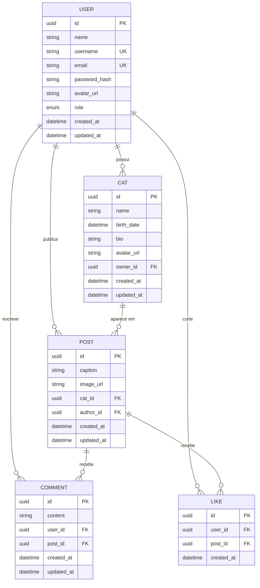

# 🗃️ Banco de Dados — Cats Backend

## Visão Geral

O Cats utiliza **PostgreSQL** como banco de dados relacional, com **Prisma** como ORM para gerenciar o schema, migrações e queries.

- **Schema:** [`prisma/schema.prisma`](../prisma/schema.prisma)
- **Client:** [`src/lib/prisma.ts`](../src/lib/prisma.ts)
- **Adapter:** `@prisma/adapter-pg` (driver nativo do PostgreSQL)

---

## Diagrama ER

---

## Modelos

### User (Usuário)

Representa o dono dos gatos na plataforma.

| Campo           | Tipo       | Descrição                                       |
| --------------- | ---------- | ----------------------------------------------- |
| `id`            | `UUID`     | Identificador único (PK)                        |
| `name`          | `String`   | Nome completo do usuário                        |
| `username`      | `String`   | Nome de usuário (único)                         |
| `email`         | `String`   | E-mail (único)                                  |
| `password_hash` | `String`   | Hash da senha                                   |
| `avatar_url`    | `String?`  | URL da foto de perfil (opcional)                |
| `role`          | `UserRole` | Papel do usuário (`USER`, `MODERATOR`, `ADMIN`) |
| `created_at`    | `DateTime` | Data de criação                                 |
| `updated_at`    | `DateTime` | Última atualização                              |

**Relacionamentos:**

- Um usuário pode ter **vários gatos** (`cats`)
- Um usuário pode fazer **vários posts** (`posts`)
- Um usuário pode escrever **vários comentários** (`comments`)
- Um usuário pode dar **várias curtidas** (`likes`)

**Tabela no banco:** `users`

---

### Cat (Gato)

Representa um gato cadastrado na plataforma.

| Campo        | Tipo        | Descrição                                |
| ------------ | ----------- | ---------------------------------------- |
| `id`         | `UUID`      | Identificador único (PK)                 |
| `name`       | `String`    | Nome do gato                             |
| `birth_date` | `DateTime?` | Data de nascimento (opcional)            |
| `bio`        | `String?`   | Biografia/descrição do gato (opcional)   |
| `avatar_url` | `String?`   | URL da foto de perfil do gato (opcional) |
| `owner_id`   | `UUID`      | ID do dono (FK → User)                   |
| `created_at` | `DateTime`  | Data de criação                          |
| `updated_at` | `DateTime`  | Última atualização                       |

**Relacionamentos:**

- Pertence a **um dono** (`owner` → User)
- Pode aparecer em **vários posts** (`posts`)

**Tabela no banco:** `cats`  
**Índice:** `owner_id`

---

### Post

Representa uma foto de gato publicada na plataforma.

| Campo        | Tipo       | Descrição                       |
| ------------ | ---------- | ------------------------------- |
| `id`         | `UUID`     | Identificador único (PK)        |
| `caption`    | `String?`  | Legenda da foto (opcional)      |
| `image_url`  | `String`   | URL da imagem                   |
| `cat_id`     | `UUID`     | ID do gato na foto (FK → Cat)   |
| `author_id`  | `UUID`     | ID do autor do post (FK → User) |
| `created_at` | `DateTime` | Data de criação                 |
| `updated_at` | `DateTime` | Última atualização              |

**Relacionamentos:**

- Pertence a **um gato** (`cat` → Cat)
- Pertence a **um autor** (`author` → User)
- Pode ter **vários comentários** (`comments`)
- Pode ter **várias curtidas** (`likes`)

**Tabela no banco:** `posts`  
**Índices:** `cat_id`, `author_id`

---

### Comment (Comentário)

Representa um comentário em um post.

| Campo        | Tipo       | Descrição                |
| ------------ | ---------- | ------------------------ |
| `id`         | `UUID`     | Identificador único (PK) |
| `content`    | `String`   | Texto do comentário      |
| `user_id`    | `UUID`     | ID do autor (FK → User)  |
| `post_id`    | `UUID`     | ID do post (FK → Post)   |
| `created_at` | `DateTime` | Data de criação          |
| `updated_at` | `DateTime` | Última atualização       |

**Relacionamentos:**

- Pertence a **um usuário** (`user` → User)
- Pertence a **um post** (`post` → Post)

**Tabela no banco:** `comments`  
**Índices:** `user_id`, `post_id`

---

### Like (Curtida)

Representa uma curtida em um post. Cada usuário pode curtir um post apenas uma vez.

| Campo        | Tipo       | Descrição                 |
| ------------ | ---------- | ------------------------- |
| `id`         | `UUID`     | Identificador único (PK)  |
| `user_id`    | `UUID`     | ID do usuário (FK → User) |
| `post_id`    | `UUID`     | ID do post (FK → Post)    |
| `created_at` | `DateTime` | Data da curtida           |

**Relacionamentos:**

- Pertence a **um usuário** (`user` → User)
- Pertence a **um post** (`post` → Post)

**Tabela no banco:** `likes`  
**Constraint único:** `(user_id, post_id)` — impede curtida duplicada  
**Índices:** `user_id`, `post_id`

---

## Enums

### UserRole

Define o nível de acesso do usuário.

| Valor       | Descrição                       |
| ----------- | ------------------------------- |
| `USER`      | Usuário comum (padrão)          |
| `MODERATOR` | Moderador com permissões extras |
| `ADMIN`     | Administrador com acesso total  |

---

---
